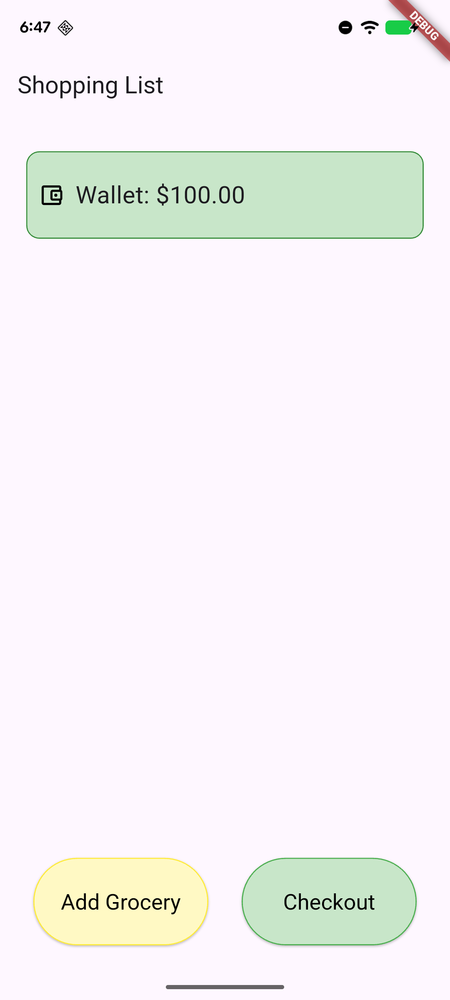
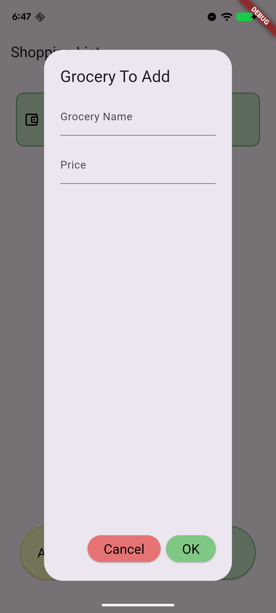
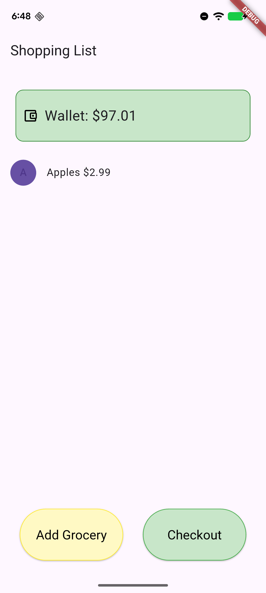
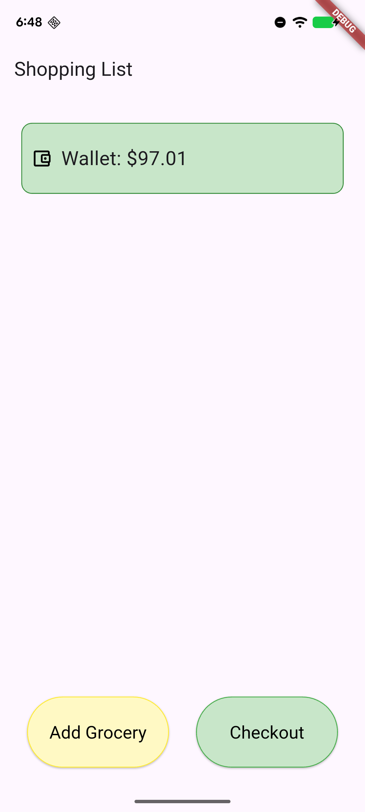

# shopping-list
A dynamic grocery list

### Intended Audience
This app is intended for anyone that could use a digital shopping list to help them budget.

### App Functionality
The app allows you to add and remove items from the shopping list, while keeping track of the prices for each item. This allows you to budget dynamically.

### Uses
While it's intended as a shopping list, it could be used as a budgeting tool for any market.

### Screenshots

### Sources
#### Colors and Color Shading
https://api.flutter.dev/flutter/material/Colors-class.html
This page helped me outline the wallet widget and use different shades of green.

#### Edge Insets
https://api.flutter.dev/flutter/painting/EdgeInsets-class.html
This page helped me learn about edge insets, which allow me to add margins and padding to my wallet widget.

#### Elevated Buttons
https://api.flutter.dev/flutter/material/ElevatedButton-class.html 
When I needed to convert my floating action buttons into elevated buttons, this page helped me learn about the basic structure and implementation of them.

https://api.flutter.dev/flutter/material/ElevatedButton/styleFrom.html 
This page helped me understand the styleFrom static method of elevated buttons, which I used to decorate my buttons.

https://api.flutter.dev/flutter/painting/BorderSide-class.html 
This page helped me understand how to outline my buttons.

https://api.flutter.dev/flutter/dart-ui/Size-class.html 
This page helped me customize the size of my elevated buttons.

#### The Wallet
https://api.flutter.dev/flutter/material/Icons-class.html 
This is the page for the flutter icon class, which is a library of thousands of icons you can use in your flutter projects! I used 'account_balance_wallet_outlined'.

https://api.flutter.dev/flutter/painting/CircleBorder-class.html 
This is the page that helped me achieve the rounded border.

https://api.flutter.dev/flutter/widgets/Padding-class.html 
This page helped me correct my padding for the wallet.

https://api.flutter.dev/flutter/painting/Border-class.html 
This is the border class, which I used to create the dark green outline of the wallet widget.

